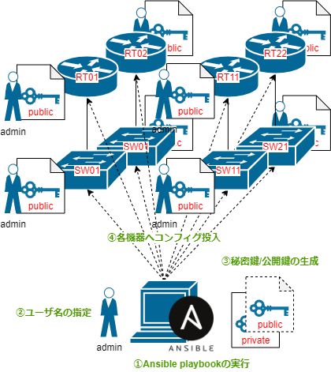

# CiscoIOSのssh公開鍵を管理するためのPlaybook

## 概要

CiscoIOS機器にssh公開鍵認証をするためのユーザを作成/削除するコンフィグを投入するためのAnsible Playbookです。

RSA鍵を新たに生成し、公開鍵をCisco機器に登録する作業を自動化します。

Ansibleを利用しているため、ネットワーク内にあるCisco機器全てに対し一括で設定を投入することができます。



上図のように、作業PC(もしくはControllerノードと呼ばれるAnsible用サーバ)からAnsibleを実行することによって、秘密鍵と公開鍵の生成・生成した公開鍵情報をネットワーク上のスイッチやルータに設定してくれます。

入力作業が発生するのは、

以下のコンフィグを `inventory.yml` に記載したCisco機器に対して投入します。

```
username <USERNAME> privilege 15
ip ssh pubkey-chain
 username <USERNAME>
  key-string
   ssh-rsa xxxxxxx
   xxxxxxxxxxxxxxx
   ...
  exit
 exit
exit
```

この設定でssh公開鍵認証ができるようになります。

Cisco機器へのssh公開鍵認証の設定等については以下の記事で詳しく説明しています。

[Cisco機器にパスワード入力してログインしてるやつなんておらんよな？？？？ ～CiscoIOSにSSH公開鍵認証を設定するの巻 - Qiita](https://qiita.com/guskma/items/5960384cf5e1c84b7259)

## 動作環境

Ubuntu22.04 on WSLで試しています。

パッケージマネージャくらいしか依存無いと思うので、RedHat系使いたい人はaptのところ読み替えてください。

また、対象のCiscoルータに対し、SSH公開鍵認証を出来るadminユーザが作成済みである必要があります。

※あくまで新規公開鍵ユーザの追加/削除をするためだけのPlaybookなので……

そもそものadminユーザを作成するためのplaybookはないの？という疑問に関しては、別途個別に相談を受けることといたします。

## 使い方

### 必要なパッケージをインストールします。

Ansible(pythonとvenv)を利用する上で必要なパッケージをインストールします。

```
# RedHat系の場合
sudo dnf install -y git python3 python3-pip

# Debian系の場合
sudo apt install -y git python3 python3-pip python3-venv
```

### Playbookのダウンロード

このリポジトリをcloneします。

```
git clone https://github.com/guskma/cisco-ios-pubkey-playbook.git
```

### venvの作成

pythonのvenv環境を作成し、activateします。

```
cd cisco-ios-pubkey-playbook
python3 -m venv venv
source venv/bin/activate
```

### Ansibleインストール

pipパッケージをインストールします。

```
pip install -U pip
pip install -r requirements.txt
```

### Playbookの設定を編集

`inventory.yml` を編集します。

ssh公開鍵を登録するCisco機器のリストを作成します。

```
vi inventory.yml
```

デフォルトの記述にあるように、 `example_router` 、 `ansible_host` の行を増やすような感じでCisco機器を追加していってください。

`example_router` の部分はわかりやすいホスト名に変更してもらって大丈夫です。代表ルータ `main_router` の値を合わせるようにしてください。

### Playbookの実行

`inventory.yml` の修正が終わったら `ansible-playbook` コマンドでplaybookを実行します。

```
# 新規ユーザを追加する場合
ansible-playbook add-pubkey.yml

# 既存ユーザを削除する場合
ansible-playbook del-pubkey.yml
```

※Playbook実行中に追加/削除をするユーザ名を指定する待ち受け状態になるので、都度入力して下さい。

